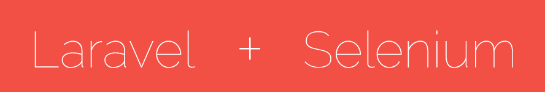

# Selenium for Laravel 5 inspired by [Integrated](https://github.com/laracasts/Integrated) package.



### Requirements:
1. Java should be installed on local machine.

### Notes:
1. You should have at least basic understanding of phpunit.
2. Not all apis in [Laracasts Package](https://github.com/laracasts/Integrated/wiki/Learn-the-API) is integrated in this package, but soon will be.
3. Tested on chrome (Recommended) and not tested on windows machine (but you can try).
4. Selenium 2.53.1 and ChromeDriver 2.23 is been used.

### Installation guide:
1. First get the package on your laravel instance `composer require modelizer/selenium`
2. Register Service provider `Modelizer\Selenium\SeleniumServiceProvider::class` in `app.php`.
3. Start Selenium Server `php artisan selenium:start`. Note: Don't stop selenium server until your test cases are completed.
4. Installation complete and selenium server up and running.

### Start Testing
1. Create a dummy `SeleniumExampleTest.php` file in `tests` directory.
2. Add this code to `SeleniumExampleTest.php` file and run phpunit `vendor/bin/phpunit tests/SeleniumExampleTest.php`
```php
<?php

use Modelizer\Selenium\SeleniumTestCase;

class SeleniumExampleTest extends SeleniumTestCase
{
    /**
     * Set up
     *
     * @return void
     */
    protected function setUp()
    {
        $this->setBrowser('chrome'); // Recommended
        $this->setBrowserUrl('http://example.dev/'); // Replace this with your actual url
    }

    /**
     * A basic functional test example.
     *
     * @return void
     */
    public function testBasicExample()
    {
        // This is a sample code you can change as per your current scenario
        $this->visit('/')
             ->see('Laravel')
             ->hold(3);
    }
}
```

### Feel free to contribute or create an issue.
 
<hr />
####More browser compatibility and laravel testing feeling will be added soon.
